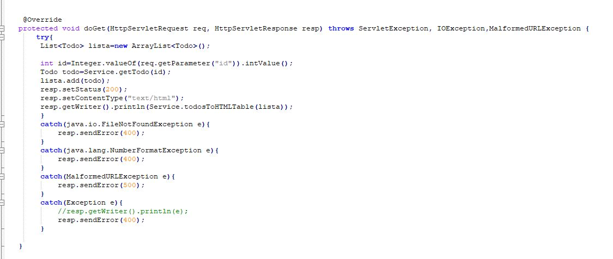
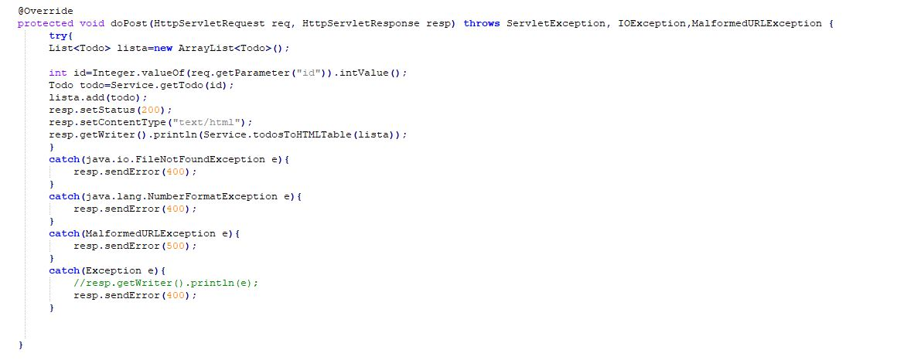
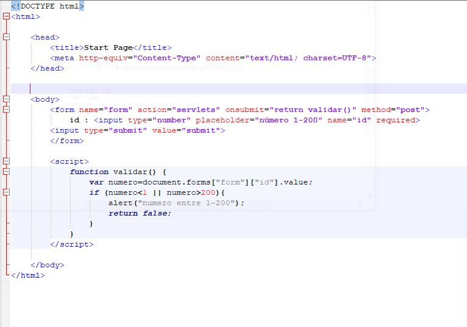
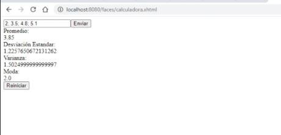
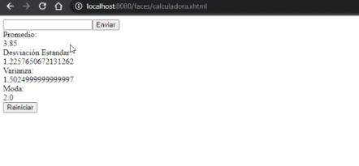

# LAB-5

**Integrantes**

- Miguel Angel Fuquene Arias
- Yarit Yajanny Villalobos

**En este laboratorio se evaluo:**

-  Se evaluo manej de paginas web
- Se manejo html, x html, javaScript, 
- Se vio el metodo doGet y doPost
- Se uso  el arquetipo de aplicación Web estándar maven-archetype-webapp

**Metodo doGet**

**Metodo doPost**

 
 La diferencia entre doGet y doPost es en su url, en el doGet aparece los parametros que se recibieron y en el doPost lo oculta
 **codigo html**
 
 
 
 
 **Calculadora con @ApplicationScoped.**
 
 
 
 
 
 @ApplicacionScoped hace que sea una aplicación compartida con otros usuarios, mientras que en @SessionScoped cada usuario tiene su propia aplicación.
 
 
     
